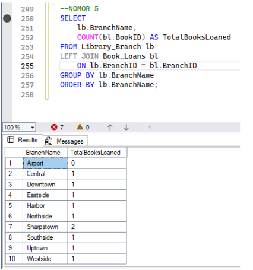

# Library Database — SQL & Relational Algebra

Project ini adalah tugas mata kuliah **Teknologi Basis Data**, Departemen Matematika, Institut Teknologi Sepuluh Nopember. Berisi implementasi skema database perpustakaan (PDM) dalam SQL, 7 query analisis data, serta pemetaan operasi **aljabar relasional** ke syntax SQL yang sesuai.

**Disusun oleh:** Raissa Undita Estiningtyas

## Struktur Database

Database terdiri dari 7 tabel:
- `Publisher` — data penerbit
- `Author` — data penulis
- `Book` — data buku (terhubung ke Publisher)
- `Book_Authors` — tabel penghubung Book ↔ Author (relasi many-to-many)
- `Library_Branch` — data cabang perpustakaan
- `Borrower` — data peminjam
- `Book_Copies` — jumlah copy tiap buku per cabang
- `Book_Loans` — catatan peminjaman buku

<!-- Tempel di sini foto ERD/PDM kamu dari dokumen tugas, contoh:-->


## Isi Repo

```
library-database-sql/
├── README.md
├── schema/
│   └── create_tables.sql   -- struktur tabel + data contoh
├── queries/
│   └── queries.sql          -- 7 query analisis
└── /              -- hasil eksekusi tiap query (opsional)
```

## Soal & Query

| No | Soal | Query |
|----|------|-------|
| 1 | Jumlah copy "The Lost Tribe" di cabang "Sharpstown" | [queries.sql](queries/queries.sql#L8) |
| 2 | Jumlah copy "The Lost Tribe" per cabang | [queries.sql](queries/queries.sql#L18) |
| 3 | Peminjam yang tidak sedang meminjam buku | [queries.sql](queries/queries.sql#L27) |
| 4 | Buku jatuh tempo hari ini di cabang "Sharpstown" | [queries.sql](queries/queries.sql#L38) |
| 5 | Total buku dipinjam per cabang | [queries.sql](queries/queries.sql#L55) |
| 6 | Peminjam dengan >5 buku aktif dipinjam | [queries.sql](queries/queries.sql#L68) |
| 7 | Buku karya Stephen King & stoknya di cabang "Central" | [queries.sql](queries/queries.sql#L97) |

## Pemetaan Aljabar Relasional ke SQL

| Simbol | Nama Operasi | Padanan SQL |
|--------|--------------|-------------|
| σ | Seleksi (Selection) | `WHERE` |
| π | Proyeksi (Projection) | `SELECT` |
| ⋈ | Join (Inner Join) | `INNER JOIN ... ON ...` |
| ⟗ | Full Outer Join | `FULL JOIN ... ON ...` |
| ⟖ | Right Outer Join | `RIGHT JOIN ... ON ...` |
| ⟕ | Left Outer Join | `LEFT JOIN ... ON ...` |
| − | Difference | `EXCEPT` (atau `NOT IN`, `NOT EXISTS`) |
| ⋃ | Union | `UNION` |
| ∩ | Intersection | `INTERSECT` |
| γ | Agregasi/Grouping | `GROUP BY` + fungsi agregat (`COUNT`, `SUM`, `AVG`, `MIN`, `MAX`) |
| ρ | Rename | `AS` |
| → | Assignment | `CREATE VIEW` atau `WITH ... AS ...` (CTE) |

## Cara Menjalankan

1. Jalankan `schema/create_tables.sql` untuk membuat tabel dan mengisi data contoh.
2. Jalankan query mana pun di `queries/queries.sql` sesuai nomor soal yang ingin dilihat.
